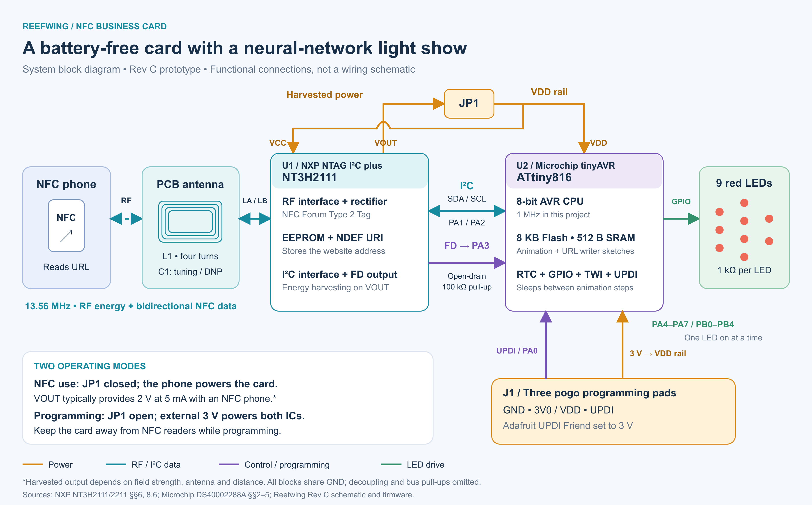

# Reefwing NFC Business Card

  

A battery-free PCB business card promoting [Embedded AI](https://nostarch.com/embedded-ai) by David Such and [Reefwing Software](https://www.reefwing.com.au/). An NFC reader field supplies energy for a nine-LED, 3–4–2 neural-network animation. The animation illustrates a network; it does not perform inference.

Inspired by [Wilson Harper's NFC business card](https://wilsonharper.net/projects/businesscard/).

## Status: Rev C prototype

The schematic and routed PCB are designed in **EasyEDA Standard**, targeting JLCPCB manufacture and assembly. These files are a work in progress, **not a manufacturing release**. Arduino animation firmware is included and compile-checked; hardware operation has not yet been tested by this workflow.

The preview is illustrative: the actual board outline is rectangular, 85 × 55 mm. Preview colours do not specify solder mask or surface finish.

## Design

- NXP NT3H2111 NTAG I²C plus with a four-turn PCB antenna and optional tuning capacitor.
- ATtiny816 with nine red LEDs, illuminated one at a time through 1 kΩ resistors.
- NFC field-detect input on PA3; alternate TWI pins PA1/PA2.
- Three front-side UPDI programming pads and a normally-open solder bridge for power isolation.
- Front and back silkscreen promoting the book and company; QR payload: `https://www.reefwing.com.au/`.

## System block diagram

The diagram below shows how the NTAG harvests energy from the phone's NFC field and supplies the ATtiny816 through JP1. The NTAG stores the website URL as an NDEF record, while the microcontroller animates the nine LEDs. Colours distinguish power, data, control and LED-drive connections.

For normal NFC-powered operation, JP1 is closed. During programming, JP1 must be open so the UPDI Friend's external 3 V supply powers both chips without feeding the NTAG's harvesting output. The I²C connection is used by the separate URL provisioning sketch; the normal animation leaves I²C disabled, and field-detect gating is optional.

The diagram is based on the supplied device datasheets and Rev C design. See the [diagram notes and sources](artwork/system-diagram/README.md), or download the [editable SVG](artwork/system-diagram/reefwing-nfc-system.svg).

## Files

| File | Purpose |
| --- | --- |
| [Reefwing-NFC-Card-RevC.json](Reefwing-NFC-Card-RevC.json) | Native EasyEDA Standard schematic project |
| [Reefwing-PCB-RevC.json](Reefwing-PCB-RevC.json) | Native EasyEDA Standard PCB with silkscreen |
| [footprints/](footprints/) | Native antenna, programming-pad and solder-bridge footprints |
| [REVIEW-REV-C.md](REVIEW-REV-C.md) | Review decisions, component changes and dated sourcing checks |
| [firmware/](firmware/) | Arduino animation and NFC URL provisioning sketches, UPDI upload guide and validation results |
| [FIRMWARE-REQUIREMENTS.md](FIRMWARE-REQUIREMENTS.md) | Firmware and programming-fixture requirements |
| [artwork/README.md](artwork/README.md) | Artwork geometry and preview limitations |
| [artwork/system-diagram/](artwork/system-diagram/) | Colour system block diagram, editable SVG, PNG and generator |

In EasyEDA Standard, use **File → Open → EasyEDA…** to import the schematic or PCB JSON. The design files contain their placed symbols and footprints. The separate footprint JSON files can be imported as PCB libraries.

## Checks and remaining work

Local structural checks reported 29 components, 84 pins, matching schematic/PCB connectivity, and no unconnected nets. Independent clearance checks passed at 0.15 mm with intentional antenna winding joins excluded. Native EasyEDA reports four DRC findings associated with the antenna; the exact Rev C findings still need final review. These checks are not electrical, RF or manufacturing validation.

Before fabrication:

- Correct and verify PCB BOM exclusions: C1 is DNP; L1, J1 and JP1 are copper features, not assembly placements. C1, L1 and J1 currently retain PCB-level BOM flags and must be excluded from any assembly export. The schematic exclusions are set.
- Review Gerbers, solder mask, paste, component orientation, silkscreen clearances and JLCPCB assembly preview.
- Recheck stock for all eight populated order codes. Stock readings in the review are dated observations, not reservations.
- Upload and bench-test firmware, verify fuses, and check the 3 V UPDI Friend/probe-clip connections. Program with JP1 open and no NFC field; disconnect the programmer before bridging JP1.
- Measure antenna resonance and tune C1 as needed; test harvested-rail startup and sag, LED brightness, phone compatibility and physical QR scanning.

The Medium design-process article is being prepared separately and is not yet published.

## Licensing

This project is released under the [MIT License](LICENSE). Copyright © 2026 Reefwing Software. Third-party component definitions retain their respective licences, and trademark rights in branding are not granted by this licence.
