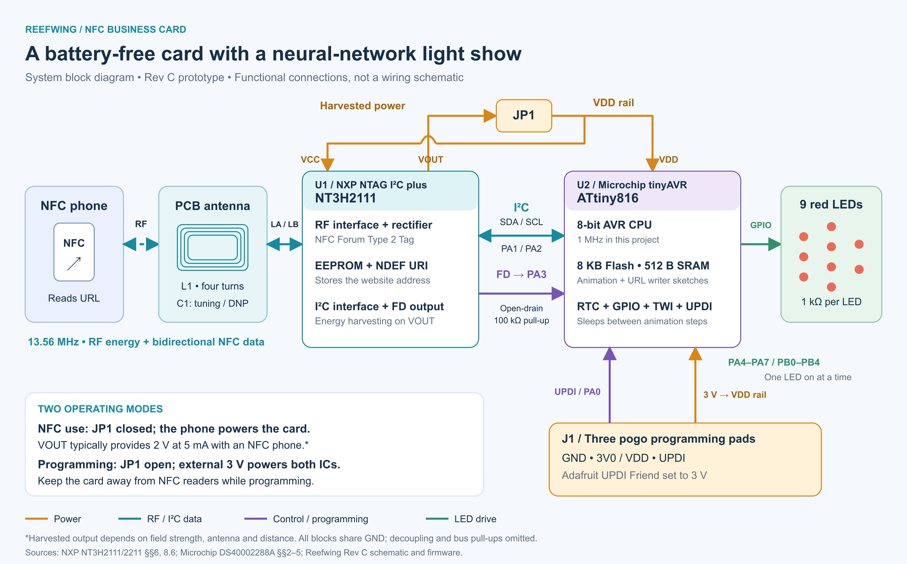

# Reefwing NFC Business Card

  

A battery-free PCB business card promoting [Embedded AI](https://nostarch.com/embedded-ai) by David Such and [Reefwing Software](https://www.reefwing.com.au/). An NFC reader field supplies energy for a nine-LED, 3–4–2 neural-network animation. The animation illustrates a network; it does not perform inference.

Inspired by [Wilson Harper's NFC business card](https://wilsonharper.net/projects/businesscard/).

## Status: Rev D design candidate

Rev D corrects the LED polarity error found during Rev C testing, adds 25 labelled probe pads, and rounds the 85 × 55 mm board's corners to a 3 mm radius. Both native files target **EasyEDA Standard** and JLCPCB manufacture. Rev C remains available as the historical manufactured baseline; do not reuse its LED polarity mapping for new boards.

See the [Rev D review, test-pad guide and orientation checks](revisions/rev-d/README.md). This is **not yet a manufacturing release**: native EasyEDA ERC/DRC, exported Gerbers, JLCPCB assembly orientation and first-article testing remain to be verified. Preview colours are illustrative.

## Design

- NXP NT3H2111 NTAG I²C plus with a four-turn PCB antenna and optional tuning capacitor.
- ATtiny816 with nine red LEDs, illuminated one at a time through 1 kΩ resistors.
- NFC field-detect input on PA3; alternate TWI pins PA1/PA2.
- Three front-side UPDI programming pads and a normally-open solder bridge for power isolation.
- Front and back silkscreen promoting the book and company; QR payload: `https://www.reefwing.com.au/`.

## System block diagram

The diagram below shows how the NTAG harvests energy from the phone's NFC field and supplies the ATtiny816 through JP1. The NTAG stores the website URL as an NDEF record, while the microcontroller animates the nine LEDs. Colours distinguish power, data, control and LED-drive connections.

For normal NFC-powered operation, JP1 is closed. During programming, JP1 must be open so the UPDI Friend's external 3 V supply powers both chips without feeding the NTAG's harvesting output. The I²C connection is used by the separate URL provisioning sketch; the normal animation leaves I²C disabled, and field-detect gating is optional.

The diagram is based on the supplied device datasheets and Rev C design. See the [diagram notes and sources](artwork/system-diagram/README.md), or download the [editable SVG](artwork/system-diagram/reefwing-nfc-system.svg).

## Files

| File | Purpose |
| --- | --- |
| [Reefwing-NFC-Card-RevD.json](Reefwing-NFC-Card-RevD.json) | Current native EasyEDA Standard schematic, with corrected LED roles and test pads |
| [Reefwing-PCB-RevD.json](Reefwing-PCB-RevD.json) | Current PCB: rounded corners, corrected LED footprints and diagnostic pads |
| [revisions/rev-d/](revisions/rev-d/) | Review, probe guide, previews, generators and validation reports |
| [Reefwing-NFC-Card-RevC.json](Reefwing-NFC-Card-RevC.json) | Historical Rev C schematic; LED pin-role error documented |
| [Reefwing-PCB-RevC.json](Reefwing-PCB-RevC.json) | Historical Rev C PCB, preserved for comparison |
| [footprints/](footprints/) | Native antenna, programming-pad and solder-bridge footprints |
| [REVIEW-REV-C.md](REVIEW-REV-C.md) | Review decisions, component changes and dated sourcing checks |
| [firmware/](firmware/) | Arduino animation, NFC URL provisioning and simple LED wiring-test sketches, UPDI upload guide and validation results |
| [FIRMWARE-REQUIREMENTS.md](FIRMWARE-REQUIREMENTS.md) | Firmware and programming-fixture requirements |
| [artwork/README.md](artwork/README.md) | Artwork geometry and preview limitations |
| [artwork/system-diagram/](artwork/system-diagram/) | Colour system block diagram, editable SVG, PNG and generator |

In EasyEDA Standard, use **File → Open → EasyEDA…** to import the schematic or PCB JSON. The design files contain their placed symbols and footprints. The separate footprint JSON files can be imported as PCB libraries.

## Checks and remaining work

Independent Rev D checks compare all 54 schematic symbols/PCB footprints and 109 pins, verify all 27 connected nets, and check 0.15 mm copper clearance with only the intentional antenna terminal contacts excluded. They also check the rounded outline, copper-to-edge clearance, test-pad paste/BOM exclusions and front silkscreen relief. Manufacturer LED A/K roles are checked explicitly, correcting the assumption that made the earlier Rev C connectivity checks insufficient.

Follow the [Rev D fabrication handoff checklist](revisions/rev-d/README.md#validation-and-fabrication-handoff) before ordering. C1 remains DNP; C1, L1, J1, JP1 and the new test pads are excluded from assembly. The original eight purchased part codes are retained, but stock must be rechecked when ordering. Antenna resonance, harvested-rail startup, LED brightness and phone compatibility still need physical validation.

The Medium design-process article is being prepared separately and is not yet published.

## Licensing

This project is released under the [MIT License](LICENSE). Copyright © 2026 Reefwing Software. Third-party component definitions retain their respective licences, and trademark rights in branding are not granted by this licence.
